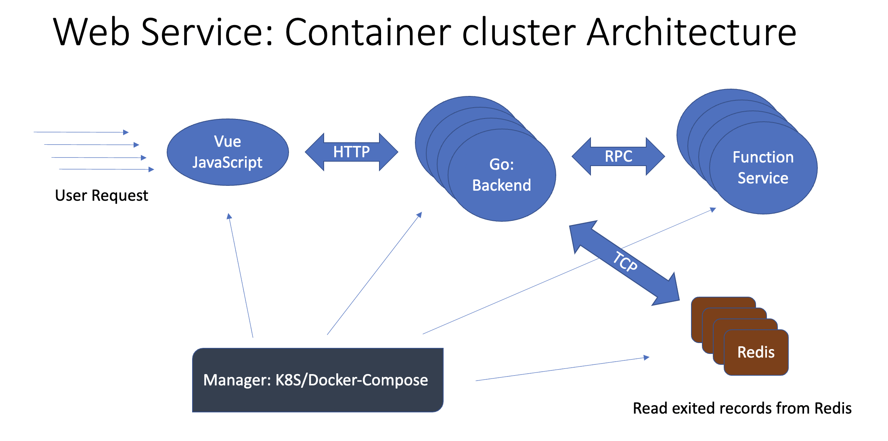

# Impact Effect Web

> [English](./doc/README_En.md) | 中文

[](https://opensource.org/licenses/MIT) 

Impact-Effect-Web项目是基于[Impact-Effect](https://github.com/acse-dx121/impact-effects)构建的小行星/彗星撞击模拟系统。根据用户给定的参数，Web程序会给出可能的相应的撞击后果。
项目基于前后端分离架构，前端基于Vue.js构建，后端基于Golang&Python 构建，支持docker-compose快速部署。

## :crystal_ball: Visuals

**Annotation Platform**


**Architecture**



**Monitor**


## 🍞 Features
- 面对场景为小规模多人图片/视频数据标注，支持多人在线标注数据，支持任务划分、权限管理等等
- 支持多种图片数据标注需求，例如矩形和多边形标注等等

##  🍕 Requirements


### Monitor

- docker-ce
- docker-compose

### Annotation Platform

#### Go + Vue.js

- Golang version >= 1.13
- Gin v1
- Gorm v1
- Mysql Version == 5.7 or 8.0
详细文档在[back-end](./server-golang/README.md)

##  🚍 Installation

### 🚀 Quick Start (local)

####  Annotation Platform

**Preparation**

- 确保安装docker 以及 docker-compose

- 克隆代码库, 修改配置并运行

```shell
git clone https://github.com/xz1220/DIG-Data-Annotation-Platform.git
# 修改前端配置并运行
cd DIG-Data-Annotation-Platform/front-end/src/model/ && vim Service.js // 修改HOST 对应后端IP地址 
cnpm install && cnpm run build 
# 修改后端配置并运行
cd DIG-Data-Annotation-Platform/server-golang/ && vim main.go
# 修改第107行 r := CollectRoute(gin.New(), "http://127.0.0.1:9999")， 将IP替换为前端IP
docker-compose -f ./doc/labelproject-golang.yml # 启动mysql & redis 镜像
go run main.go # 启动后端程序
```

**Installation By docker-compose**
在front-end和server-golang的目录下，都存放着Dockerfile文件，方便容器化前后端。可自定义修改labelproject-golang.yml文件，实现一键部署。
```shell
docker build -t <your imageName:tag> .
```

#### Monitor 

**Preparation** 

- 确保安装docker 以及 docker-compose

**Installation**

```shell
git clone https://github.com/xz1220/LabelDoc.git 
cd LabelDoc/monitor
docker-compose -f monitor.yml up
```

##  🚩 **Usage**

#### 🖼 Annotation Platform

- 初始化用户名：admin 密码：admin

### 🖥 Monitor

- 入口 ： http://localhost:8888
- 初始化数据库
  - URL：http://172.23.0.2:8086
  - 用户名免密为空
- 选取默认面板进入系统


