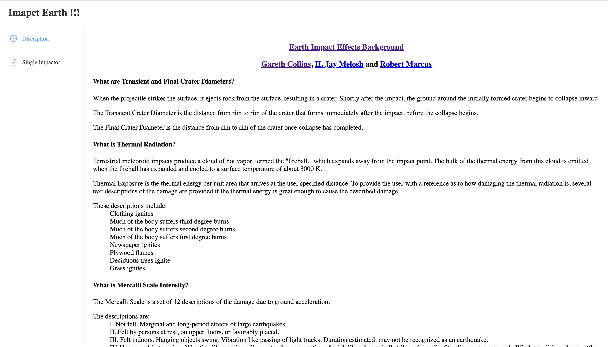

# Impact Effect Web

> [English](./doc/README_En.md) | 中文

[](https://opensource.org/licenses/MIT) 

Impact-Effect-Web项目是基于[Impact-Effect](https://github.com/acse-dx121/impact-effects)构建的小行星/彗星撞击模拟系统。根据用户给定的参数，Web程序会给出可能的相应的撞击后果。
项目基于前后端分离架构，前端基于Vue.js构建，后端基于Golang&Python 构建，支持docker-compose快速部署。

## :crystal_ball: Visuals

**Annotation Platform**


**Architecture**


## 🍞 Features

- 支持用户自定义输入数据，计算相关撞击结果。
- 支持Docker Compose 安装

## 🍕 Requirements

### Back-end

- python > 3.7
- Golang >= 1.14
- Gin v1
- Gorm v1
- Redis
- GRPC
- Docker(optional)

### Fore-end

- node.js
- npm/cnpm
- vue.js/webPack/etc

## 🚍 Installation

### 🚀 Quick Start (Docker)

后端所有服务被容器化，项目在根目录下提供了一个cluster.yml文件。可以支持使用Docker-compose进行一键启动.

```shell
docker-compose -f cluster.yml up // create the cluster
docker-compose -f cluster.yml down //distory the cluster
```

前端服务由于需要访问后台服务，容器化后台时已指定固定IP地址，因此一般来说不需要进行修改即可运行。

```bash
cd front-web
npm install
npm run dev
```

### manul install

**克隆项目** 首先将项目整体克隆下来

```bash
# clone the project
git clone https://github.com/acse-dx121/impact-effects-web.git
```

**Function Service** 进入function service目录下构建项目, service 将监听50051端口。请确保防火墙端口开发，否则访问不到服务。

```bash
cd function-service
# create the virtural env
conda env create -f environment.yml
# activate env
conda activate functions-service
# run the service
python service.py


```

**Back-end Service** 进入back-web目录下运行后端程序，服务将监听50052端口。请确保防火墙端口开发，否则访问不到服务。另外，如果手动修改了函数服务以及redis服务的监听端口，需要进入相应文件中进行修改。

```bash
# make sure you already install golang
cd back-web && go mode tidy 
# run the service
go run main.go
```

**Fore-end Service** 进入Front-web 目录下运行前端程序，服务将监听9999端口。同样的，确保防火墙设置正确，以及后端服务的端口号正确。

```bash
cd front-web
npm install
npm run dev
```

## 🚩 Usage

#### 🖼 Annotation Platform

- 初始化用户名：admin 密码：admin

### 🖥 Monitor

- 入口 ： http://localhost:8888
- 初始化数据库
  - URL：http://172.23.0.2:8086
  - 用户名免密为空
- 选取默认面板进入系统
